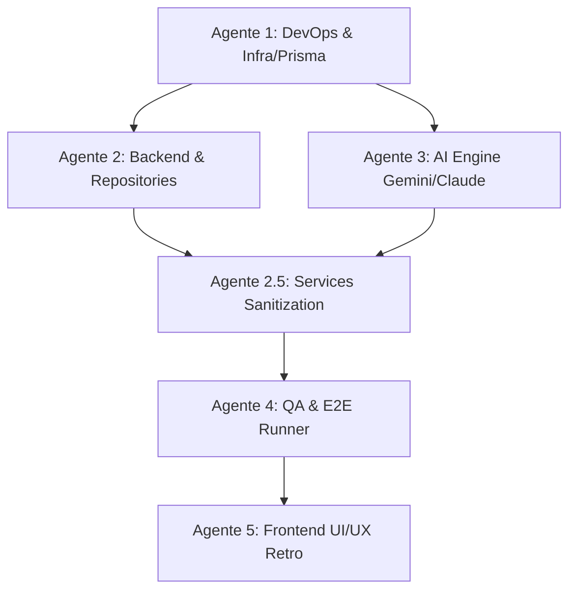

# 📋 Multi-Agent Tasklist: Operação Mundo Refactoring & Polish

Este documento distribui as frentes de trabalho em **Agentes Especializados**, com ordem de dependência, escopo atômico e critérios de aceite.

---

## 🗺️ Mapa de Dependência entre Agentes

---

## 🤖 Agente 1: DevOps & Database Specialist (Infra & Modelagem)
> **Missão**: Estabelecer a infraestrutura PostgreSQL no Docker e a modelagem relacional type-safe via Prisma.

- [x] **Task 1.1 — Docker Compose Setup**:
  - Criar `docker-compose.yml` na raiz com o serviço `postgres:16-alpine`, volume persistente `pgdata`, porta `5433` e healthcheck.
  - Atualizar `.env.example` e documentação de inicialização com `DATABASE_URL`.
  - ✅ `docker-compose.yml`, `.env.example` (raiz), `backend/.env.example`, `docs/database-setup.md`.
- [x] **Task 1.2 — Prisma Schema (`backend/prisma/schema.prisma`)**:
  - Modelar entidades: `User`, `Token`, `Profile`, `ActiveCase`, `CaseRoute`, `CaseVisit`, `City`, `Suspect`, `SuspectAttribute`, `Clue`, `Warrant`, `GameDifficulty`, `Rank`, `ReputationRule`, `PlayerReputationHistory`, `PlayerXpHistory`, `CasePerformance`.
  - Definir índices, foreign keys e enums (`CaseStatus`, `ClueType`, `WarrantStatus`, etc.).
  - ✅ 34 modelos (superconjunto das entidades acima, cobrindo todas as tabelas usadas pelos repos atuais), enums `CaseStatus`/`Difficulty`/`ClueType`, FKs/índices explícitos, migration `20260828143407_init` aplicada. Coordenadas de cidade migradas de `POINT` para `latitude`/`longitude` (Float).
- [x] **Task 1.3 — Seed Automatizado (`backend/prisma/seed.js`)**:
  - Migrar dados base de cidades mundiais (Américas, Europa, Ásia, África, Oceania com coordenadas e pistas culturais).
  - Seed de arquétipos de suspeitos (traços físicos, veículos, hobbies).
  - Seed de patentes (Recruta a Diretor da ACME) e regras de XP / Reputação.
  - ✅ Idempotente: 6 regiões · 34 países · 37 cidades · 12 tipos de local · 55 atributos · 3 dificuldades + regras XP · 5 faixas de reputação · 6 patentes. Config `prisma.seed` + script `npm run db:seed`.
- [x] **Task 1.4 — Instanciação do Prisma Client (`backend/src/config/prisma.js`)**:
  - Criar singleton do `PrismaClient` com logs configuráveis em ambiente de desenvolvimento.
  - ✅ Singleton via `globalThis` (evita conexões duplicadas no hot-reload), logs `query/warn/error` em dev.

---

## 🤖 Agente 2: Backend & Repositories Specialist (Core Data Layer)
> **Missão**: Refatorar a camada de persistência para usar o Prisma Client mantendo os contratos com `services/`.

- [x] **Task 2.1 — Auth & Profile Repositories**:
  - Refatorar `user.repo.js`, `token.repo.js`, `profile.repo.js`, `ranks.repo.js`.
  - Garantir integridade de hash de senha (`bcrypt`) e tokens de refresh.
- [x] **Task 2.2 — Case & Route Repositories**:
  - Refatorar `case.repo.js`, `case_time_state.repo.js`, `case_performance.repo.js`, `route.repo.js`.
  - Ajustar transações atômicas de geração de caso e avanço de etapa de rota.
- [x] **Task 2.3 — Gameplay & Investigation Repositories**:
  - Refatorar `visit.repo.js`, `clue.repo.js`, `travel.repo.js`, `travel_log.repo.js`, `current_view.repo.js`.
  - Validar consumo de horas in-game e histórico de visitas por local.
- [x] **Task 2.4 — Suspects, Dossier & Warrant Repositories**:
  - Refatorar `suspect.repo.js`, `dossier.repo.js`, `warrant.repo.js`, `captured.repo.js`, `attributes.repo.js`.
  - Otimizar filtros de busca de suspeitos no dossiê através de queries relacionais do Prisma.
- [x] **Task 2.5 — Progression & Gamification Repositories**:
  - Refatorar `player_reputation.repo.js`, `player_reputation_history.repo.js`, `player_xp_history.repo.js`, `xp_rules.repo.js`, `reputation_rules.repo.js`, `game_difficulty.repo.js`.
  - Extra: `city.repo.js`, `travel_overrides.repo.js`, `profile_stats_history.repo.js` migrados para Prisma.

---

## 🤖 Agente 2.5: Backend Services Sanitization (Expurgar MySQL & Encapsular Repos)
> **Missão**: Eliminar todo e qualquer vazamento de SQL direto e imports de `database.js` em `backend/src/services/`, transferindo consultas para os repositórios Prisma correspondentes.

- [x] **Task 2.5.1 — Encapsular Métodos Faltantes nos Repositórios**:
  - `case.repo.js`: Adicionar `getCaseById(caseId)`, `getCaseDifficulty(caseId)` e `updateCaseMetadata({ id, stolenObject, introText })`.
  - `city.repo.js`: Adicionar `getCityWithCountry(cityId)` para retornar nome da cidade e nome do país.
  - `clue.repo.js`: Adicionar suporte a `case_villain_clues` (`insertVillainClues(caseId, attributes)`, `pickUnrevealedVillainClue(caseId)`, `markVillainClueRevealed(id)`).
  - `travel_log.repo.js`: Adicionar `getLastTravelLog(caseId)` e `updateTravelLogArrival(id)`.
  - `profile.repo.js`: Adicionar `getProfileCaseCounters(profileId)` e `updateProfileCaseCounters(profileId, solved, failed)`.
  - `route.repo.js`: Adicionar `countRoutesForCase(caseId)` e `getCaseProfileInfo(caseId)`.
  - ✅ Extra (necessário para zerar SQL cru remanescente): `city.repo.js.getAllCitiesForRouting()`/`getCitiesByIds(ids)`, `case.repo.js.getRecentCasesWithXp()`, `clue.repo.js.pickAnyVillainClue()`, e `world.repo.js` (antes vazio) com `getCountryRegionId()`/`isNeighborCountry()` para region/vizinhança de países.

- [x] **Task 2.5.2 — Refatorar os 10 Arquivos de Services**:
  - `case.service.js`: Remover `pool.query`, consumir `getCityWithCountry` e `updateCaseMetadata`.
  - `visit.service.js`: Remover `pool.query`, consumir `travel_log.repo.js` e `city.repo.js.getCitiesByIds`.
  - `travel.service.js` & `time.service.js`: Remover `import('../config/database.js')`, consumir `getCaseDifficulty` de `case.repo.js` e `world.repo.js` para region/vizinhança.
  - `investigate.service.js`: Remover `import('../config/database.js')`, consumir repositórios de perfil e caso.
  - `clue.manager.service.js`: Remover `pool.query`, consumir `clue.repo.js`.
  - `route.generator.service.js`: Remover `pool.execute`, consumir `route.repo.js`, `profile.repo.js`, `ranks.repo.js` e `city.repo.js`.
  - `phase.seed.service.js`: Remover `pool.execute`, usar `getAllPlaceTypes()`/`setCaptureFlag()` de `visit.repo.js`.
  - `profile_summary.service.js`: Remover `pool.execute`, usar métodos de `profile.repo.js` e `case.repo.js.getRecentCasesWithXp`.
  - ✅ Validado end-to-end via HTTP contra PostgreSQL real: registro → perfil → criar caso → visitar → investigar (NEXT_LOCATION e VILLAIN_ATTRIBUTE) → viajar → travel-log → resumo do perfil, todos OK.

- [x] **Task 2.5.3 — Saneamento de Startup e Expurgar MySQL**:
  - `backend/src/server.js`: Remover chamadas de `runMigrations()` e `ensureExpandedAttributes()`.
  - Remover/excluir arquivos obsoletos: `backend/src/services/migration.service.js`, `backend/src/services/seed_attributes.service.js`, `backend/src/services/case.planner.js`.
  - Excluir o arquivo de conexão legado: `backend/src/config/database.js`.
  - Remover pacote `mysql2` de `backend/package.json` (e `package-lock.json` já sem a entrada).
  - ✅ `grep` confirma zero ocorrências de `database.js`/`pool.query`/`pool.execute`/`db.execute`/`mysql2` em `backend/src` (fora de um comentário morto em `visit.controller.js`).

---

## 🤖 Agente 3: AI Engine & Narrative Specialist (GenAI Layer)
> **Missão**: Desacoplar a OpenAI e implementar provedor universal com Google Gemini e Anthropic Claude.

- [x] **Task 3.1 — Universal AI Adapter (`backend/src/ai/ai.client.js`)**:
  - Implementar suporte ao SDK oficial `@google/genai` (Gemini 2.5 Flash / 1.5 Flash).
  - Implementar suporte opcional ao SDK `@anthropic-ai/sdk` (Claude 3.5 Haiku).
  - Chaveamento dinâmico via variável de ambiente `AI_PROVIDER=gemini|claude`.
  - ✔ `ai.client.js` com lazy-load por provedor, `callAI` (texto) + `callAIStructured` (JSON), timeout global e retries. `openai.client.js` removido.
- [x] **Task 3.2 — Structured Output & Schemas**:
  - Implementar `responseSchema` nativo para garantir retornos JSON estritamente válidos sem quebra de parse.
  - Atualizar `prompt.builder.js` e `ai.guard.js` com diretrizes de estilo, tom urgente e diegético.
  - ✔ `responseSchema` nativo do Gemini + parse tolerante (`parseJsonLoose`). `prompt.builder.js` com bloco de TOM (urgente/misterioso/culturalmente preciso) e `CASE_METADATA_SCHEMA`. `ai.guard.js` com `guardAIJson` e verificação de quebra de imersão.
- [x] **Task 3.3 — Geradores de Casos & Pistas**:
  - Refatorar `case.generator.service.js` para criar briefings culturais ricos baseados na cidade de partida.
  - Refatorar `clue.generator.service.js` para gerar diálogos de testemunhas adaptados à reputação do detetive (Alta / Neutra / Baixa).
  - ✔ Ambos migrados para o adaptador universal; `case.generator` usa `buildCaseBriefingPrompt` + saída estruturada; `clue.generator` usa fallback por reputação × tipo de pista.
- [x] **Task 3.4 — Sistema de Fallbacks Diegéticos**:
  - Garantir que caso a IA atinja timeout ou falha de rede, fallbacks culturais coerentes sejam entregues instantaneamente.
  - ✔ `backend/src/ai/fallbacks.js`: `clueFallback` (ALTA/NEUTRA/BAIXA × NEXT_LOCATION/VILLAIN_ATTRIBUTE/WARNING/CAPTURE) e `caseFallback` (briefing por região). `name.generator.js` também com nomes offline.

---

## 🤖 Agente 4: QA, Testing & Observability Specialist (Qualidade & E2E)
> **Missão**: Validar integridade de ponta a ponta e garantir observabilidade do sistema.

- [x] **Task 4.1 — Validação dos Testes Unitários**:
  - Executar `npm test` no backend garantindo 100% de aprovação nos testes (`time.rules.test.js`, `dossier.rules.test.js`, `xp.rules.test.js`).
  - ✅ 42/42 testes aprovados, 0 falhas, 11 suites (`node --test`), ~180ms de duração total.
- [x] **Task 4.2 — Simulação E2E Completa (`backend/tools/runner.js`)**:
  - Executar `npm run e2e` (`node tools/runner.js`) cobrindo: `Login → Criar Caso → Visitar Locais → Decifrar Pistas → Viajar → Emitir Warrant → Capturar Vilão → Validar XP`.
  - Garantir que nenhum erro de conexão com PostgreSQL ou queries quebradas ocorra.
  - ✅ Rodada completa contra PostgreSQL real (27 passos): caso criado, rota percorrida, pistas investigadas, warrant emitido para o suspeito correto, vilão capturado, caso `SOLVED`, XP registrado (250 pts). Veredito do runner: `{"solved":true,"xpRecorded":true,"warrantCorrect":true,"pass":true}`. Nenhum erro de conexão ou query.
- [x] **Task 4.3 — Telemetria Prometheus & Healthcheck**:
  - Validar métricas em `/metrics` e endpoints `/ping` e `/health`.
  - ✅ `/ping` e `/health` respondem `ok:true` (health inclui checagem de latência do PostgreSQL). `/metrics` expõe métricas padrão do Node.js (process/eventloop) + métricas customizadas da aplicação: `http_requests_total`, `http_request_duration_seconds`, `ai_requests_total`, `ai_request_duration_seconds`.

### 🐛 Bugfix descoberto e corrigido durante a validação de QA

- **`backend/src/services/travel.service.js`** — chamada de `estimateTravelMinutes(...)` usava um objeto único `{ fromCityId, toCityId, caseId }`, mas a função em `time.service.js` tem assinatura **posicional** (`estimateTravelMinutes(fromCityId, toCityId, caseId = null)`). Isso fazia `fromCityId` virar o objeto inteiro, `getCityById` receber `Number(objeto)` = `NaN`, `getCityById` retornar `null`, e a função lançar `Error('Cidade inválida para cálculo de viagem')` — erro que era engolido silenciosamente por um `try/catch` que só fazia `console.warn`. **Efeito prático: toda viagem no jogo era "de graça" — o relógio in-game nunca avançava durante uma viagem**, quebrando silenciosamente a mecânica de prazo/deadline. O runner E2E não pegava isso porque nunca comparava `timeState.current_time` antes/depois de uma viagem especificamente.
- **Correção**: chamada trocada para argumentos posicionais — `estimateTravelMinutes(currentStep.city_id, destinationCityId, caseId)`.
- **Validação pós-fix**:
  - Script dedicado via HTTP + Prisma comparando `timeState.current_time` antes/depois de uma única viagem: relógio avançou **360 minutos (6h)** (antes do fix: 0 minutos, viagem grátis).
  - `npm test`: 42/42 aprovados novamente, nenhuma regressão.
  - `npm run e2e` completo (dificuldade EASY): ainda `pass:true` (`solved`, `xpRecorded`, `warrantCorrect`). `daysEarly` final caiu de 5 (antes do fix, tempo de viagem grátis) para 4 (depois do fix, tempo de viagem real sendo consumido) — confirma que a mecânica de prazo agora reflete o tempo real gasto viajando, sem quebrar a partida completa no piso de dificuldade EASY.

---

## 🤖 Agente 5: Frontend & UX Retro Specialist (Nuxt 3 & Polish)
> **Missão**: Garantir integração perfeita com as novas APIs e polir a experiência imersiva retrô.

- [x] **Task 5.1 — Alinhamento de Payloads com o Backend**:
  - Validar composables `useGame.ts`, `useAuth.ts` e `useApi.ts` com os novos contratos da API.
  - Assegurar tratamento suave de silent refresh e loading states no terminal CRT.
- [x] **Task 5.2 — Polimento Visual & Retro Aesthetic**:
  - Revisar efeitos CRT (scanlines, tipografia `Press Start 2P`/`VT323`, bordas âmbar/ciano).
  - Aperfeiçoar animação de texto datilografado (*typewriter effect*) nas pistas da testemunha e no briefing.
- [x] **Task 5.3 — Responsividade do Dossiê & Mapa Mundi**:
  - Otimizar a tela de investigação e emissão de mandado em diferentes resoluções.
  - Suporte a feedback sonoro retrô (beeps de terminal e confirmação de viagem).
- [x] **Task 5.4 — Build & Validação**:
  - Executar `npm run build` no frontend garantindo zero erros de tipagem TypeScript e empacotamento SPA perfeito.

---

## 🏁 Critérios de Conclusão Global (Definition of Done)
1. `docker compose up -d` sobe o PostgreSQL sem intervenções manuais.
2. `npx prisma migrate dev` e `npx prisma db seed` executam com sucesso.
3. Backend responde a criação de casos e geração de pistas em < 800ms via Gemini Flash / Claude.
4. Camada de `services/` livre de qualquer chamada SQL manual ou import de `database.js`.
5. Runner E2E completa uma partida inteira com 100% de sucesso.
6. Frontend compila sem warnings e executa a gameplay perfeitamente no navegador.
